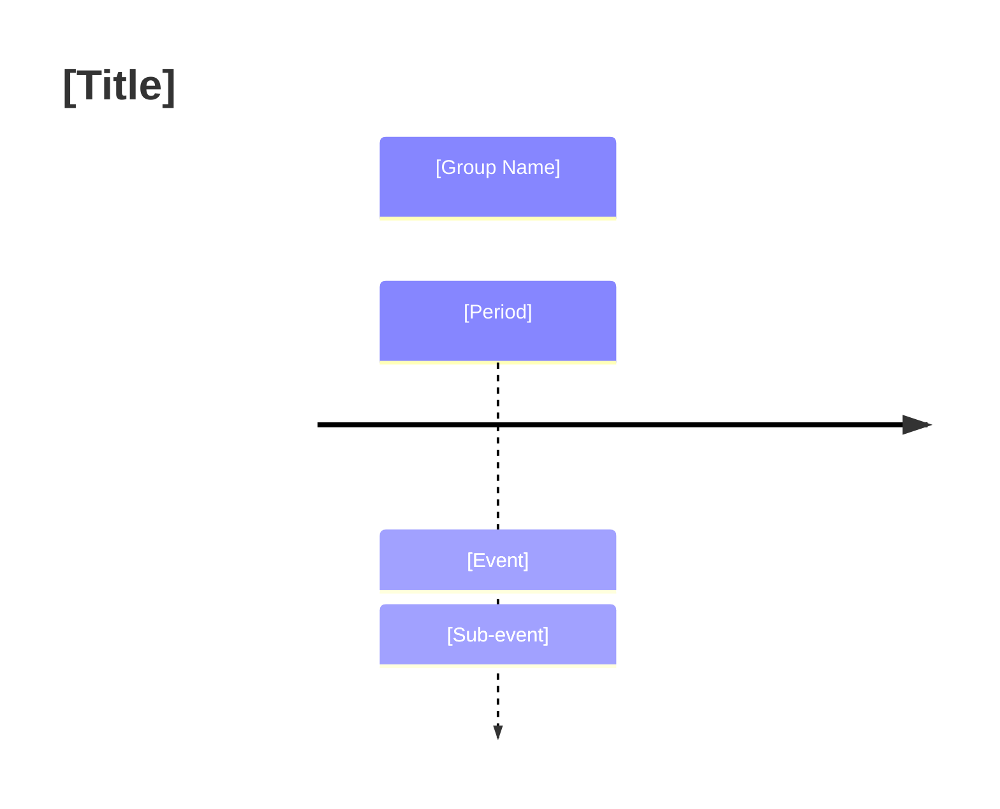
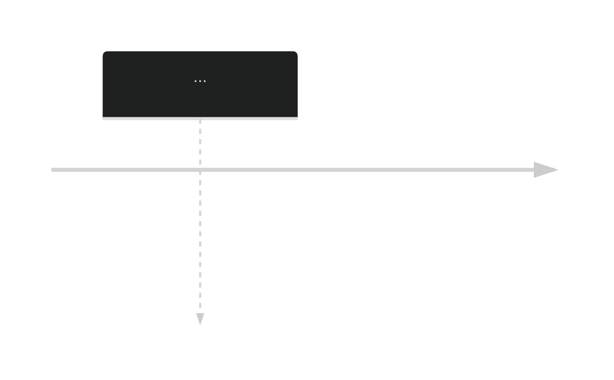

# Mermaid Timeline Diagram Skill

This skill provides the procedural expertise to convert text-based chronological data into visual Mermaid timeline diagrams suitable for Obsidian and Quartz.

## Mandatory Interaction Protocol

Before generating a diagram, the Agent **must** ask the user for:
1. **Direction**: Should the timeline flow horizontally (`LR`) or vertically (`TD`)?
2. **Style Preference**: Should it use a standard theme (e.g., `dark`, `forest`) or a custom color scheme?
3. **Detail Level**: Should every sub-event be included, or should we focus on the primary narrative anchors?

## Syntax Reference

Always wrap the diagram in a standard mermaid block:

## Styling & Configuration

To customize colors or themes, use the YAML configuration header:

## Strategy: From Dossier to Diagram

**Mandate: Never remove or replace original text. Visual diagrams are to be appended as supplemental layers only.**

1. **Extract**: Identify the `EVT` IDs and dates from the Dossier.
2. **Compress**: Shorten descriptions to fit inside boxes (use ` ` for forced line breaks).
3. **Categorize**: Use `section` to represent "Ages" or "Eras" identified in the internal memos.
4. **Clarify**: Present the drafted syntax to the user for approval before inserting it into a note.

---
*Reference: Clippings/Mermaid-timeline-diagrams.md*
