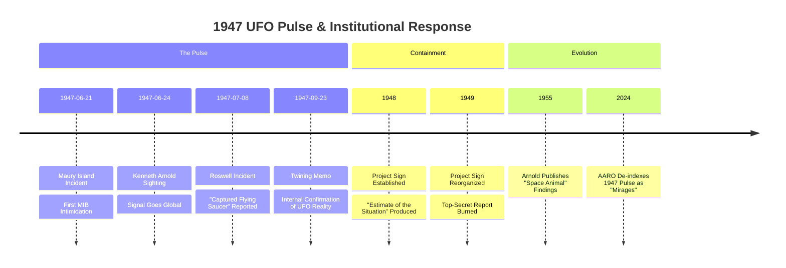

# DOS: The 1947 Kenneth Arnold UFO Sighting & The Birth of the UFO Era

### TL;DR
On June 24, 1947, Kenneth Arnold captured the first "high-fidelity" signal of the modern era. While the public focused on "Flying Saucers," the System used the event to initialize the [[ORG-0002-air-material-command|Air Material Command's]] redaction protocols, effectively de-indexing the phenomenon from civilian science for the next 80 years.

---

## 1. WHY: The Initialization Vector
The [[EVT-0006-mt-rainier-sighting|Mt. Rainier Sighting]] was not merely a pilot's encounter; it was the "Hello World" of modern UAP phenomenology. It forced the U.S. military to move from passive observation to active containment, birthing [[ORG-0003-project-sign|Project Sign]] and establishing the dual-track reality we occupy today.

## 2. WHAT: The Signal Components
- **The Pilot**: [[PER-0006-kenneth-arnold|Kenneth Arnold]], a credible, high-hour civilian pilot whose "skipping saucer" description was mistranslated by the press, creating a linguistic smoke screen.
- **The Objects**: Nine craft moving at ~1,200 mph, displaying "transmedium" motion characteristics later mirrored in the modern [[PHE-0001-jellyfish-uap|Jellyfish UAP]].
- **The Rebuttal**: The [[ORG-0004-aaro|AARO]]-style "mirage" explanation was first stress-tested here, despite internal memos from General Nathan Twining confirming the craft were "real."

## 3. HOW: The Mechanism of Redaction
The System employs a "Hardware-to-Hysteria" pipeline:
1. **Validation**: Internal military confirmation of physical anomalies ([[ORG-0002-air-material-command|AMC]]).
2. **Public Friction**: Intentional release of conflicting data to create "UFO Hysteria."
3. **De-indexing**: Threatening primary witnesses (as seen in the [[EVT-0007-maury-island-incident|Maury Island Incident]]) to ensure the signal remains "noise" in official records.

## 4. WHAT IF: The Biological Pivot
What if the craft aren't "craft"? Later in life, Arnold proposed the [[PAT-0002-space-animal-hypothesis|Space Animal Hypothesis]]. If UAPs are biological organisms living in the upper atmosphere, our current "National Security" response is not an investigation into technology, but a systematic culling of an indigenous, non-human biosphere.

---

## Timeline: The 1947 UFO Sighting Pulse

- **1947-06-21**: [[EVT-0007-maury-island-incident|Maury Island Incident]]; first reported "Men in Black" intimidation.
- **1947-06-24**: [[EVT-0006-mt-rainier-sighting|Kenneth Arnold sighting]]; signal goes global.
- **1947-07-08**: Roswell Daily Record reports "Captured Flying Saucer."
- **1947-09-23**: Twining Memo confirms UFOs are "real" to AMC.
- **1948-01-22**: [[ORG-0003-project-sign|Project Sign]] established.
- **1948-10-01**: "Estimate of the Situation" report burned on orders of Gen. Vandenberg.
- **1955-01-29**: Arnold publishes "Space Animal" findings in La Grande Observer.
- **2024-01-09**: [[ORG-0004-aaro|AARO]] releases historical report de-indexing Arnold's sighting as "mirage."

---

## Citations & Sources
- [Richard Dolan: UFOs and the National Security State (2002)](https://archive.org/details/ufosnationalsecu00dola)
- [The Coming of the Saucers (Kenneth Arnold, 1952)](https://archive.org/details/the-coming-of-the-saucers_202210)
- [Edward Ruppelt: The Report on Unidentified Flying Objects (1956)](https://archive.org/details/reportonunidenti00rupp)
- [Weaponized: THE 'JELLYFISH' UFO - How It Happened](https://weaponizedpodcast.com/episodes-1/the-jellyfish-ufo)

