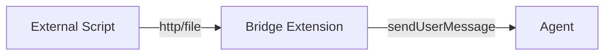

# Agent Message Injection — The Super Power

> **What it is**: The ability for any piece of code (extension, script, watcher, server) to inject a message into the agent's chat stream — waking the agent up and giving it new context.

## Why This Is a Super Power

Normally, an agent only responds to user messages. Everything is a turn-based conversation:

```
User says something → Agent processes → Agent responds → (wait)
```

Message injection breaks this model. **External code can now initiate a turn**:

```
Timer fires → Injects message → Agent wakes up → Agent responds
Dashboard button clicked → Injects message → Agent wakes up → Agent responds
File watcher detects change → Injects message → Agent wakes up → Agent responds
```

This makes the agent **event-driven**, not just conversation-driven.

---

## The Mechanism: `pi.sendUserMessage()`

### Signature

```typescript
pi.sendUserMessage(
  message: string,         // What the agent "hears"
  options?: {              // Delivery behavior
    deliverAs?: "steer" | "followUp"
  }
)
```

### How It Works

1. A message appears in chat **as if the user typed it**.
2. The agent sees the message in its context and processes it.
3. The agent can then use tools, ask questions, or perform actions.

To the agent, an injected message is **indistinguishable** from a real user message.

---

## Delivery Modes

There are two delivery modes, and choosing the right one matters.

### `deliverAs: "steer"`

```
┌─────────┐     ┌──────────────┐     ┌─────────┐
│ Timer   │────→│ Queue after  │────→│ Agent   │
│ fires   │     │ current turn │     │ receives│
└─────────┘     └──────────────┘     └─────────┘
```

- Queues the message to arrive after the agent finishes its current turn
- Still arrives **before the next LLM call** (so agent sees it before thinking)
- Best for: **in-turn notifications** where timing is flexible
- Risk: can conflict if the agent is in the middle of tool calls

### `deliverAs: "followUp"`

```
┌─────────┐     ┌──────────────────┐     ┌─────────┐
│ Timer   │────→│ Wait for agent   │────→│ Agent   │
│ fires   │     │ to be completely │     │ receives│
│         │     │ idle             │     │         │
└─────────┘     └──────────────────┘     └─────────┘
```

- Waits until the agent is **completely idle** (no streaming, no tool calls)
- Safer for async/out-of-band triggers
- Best for: **timer callbacks, webhook responses, dashboard interactions**
- Trade-off: may be delayed if agent is in a long processing chain

### Comparison

| Aspect | `"steer"` | `"followUp"` |
|--------|-----------|--------------|
| Delivers during tool calls | Sometimes (can collide) | Never (waits for idle) |
| Safe for timer callbacks | ❌ Risk of collision | ✅ Fully safe |
| Delay | Minimal | May wait |
| Recommended for | Synchronous in-turn | Async out-of-band |

---

## The Retry Pattern

Timer callbacks fire from `setTimeout`, outside any normal agent turn. The agent might be mid-stream. To handle this reliably:

```typescript
function sendNotification(pi: ExtensionAPI, message: string, attempt = 0): void {
  const maxRetries = 10;
  const baseDelay = 500; // 500ms initial

  try {
    pi.sendUserMessage(message, { deliverAs: "followUp" });
  } catch (err) {
    if (attempt < maxRetries) {
      // Exponential backoff: 500ms, 1s, 2s, 4s... cap at 5s
      const delay = Math.min(baseDelay * Math.pow(2, attempt), 5000);
      setTimeout(() => {
        sendNotification(pi, message, attempt + 1);
      }, delay);
    } else {
      // Give up — log failure (can't show in chat at this point)
      console.error("[tool] Failed to send after", maxRetries, "retries:", message);
    }
  }
}
```

**Why retry?** The `"followUp"` mode usually works, but there's a brief window during session transitions where even it can fail. Retrying catches those races.

---

## Reference Implementation: Schedule Extension

The schedule extension is the canonical example of this pattern. Here's exactly how it's wired:

### 1. Extension Setup

```typescript
export default function scheduleExtension(pi: ExtensionAPI) {
  // Register tools and commands...
}
```

### 2. Timer Callback Uses Helper

```typescript
setTimeout(() => {
  // ... cleanup ...
  sendTimerNotification(pi, "⏰ Timer: " + note);
  // ... cleanup ...
}, ms);
```

### 3. Helper Wraps sendUserMessage

```typescript
function sendTimerNotification(pi, message, attempt = 0) {
  try {
    pi.sendUserMessage(message, { deliverAs: "followUp" });
  } catch (err) {
    // retry with backoff...
  }
}
```

The **full source** is at `.pi/extensions/schedule/index.ts`.

---

## How to Reuse This Pattern in Other Scripts

### Option 1: Pi Extension (Recommended)

Create a new extension that follows the same structure:

```typescript
import type { ExtensionAPI, ExtensionContext } from "@earendil-works/pi-coding-agent";
import { Type } from "typebox";

export default function myExtension(pi: ExtensionAPI) {
  // Register your tools/commands here
  pi.registerTool({
    name: "my_tool",
    // ...
    async execute(/*...*/) {
      // When you need to inject a message:
      sendAgentMessage(pi, "Something happened!");
    },
  });
}
```

Your extension can call `sendAgentMessage()` from any context — `setTimeout`, `setInterval`, file watchers, HTTP callbacks, etc.

### Option 2: External Script (File Watcher / HTTP Server)

If your code runs **outside** of pi (e.g., a Python dashboard, a Node.js watcher), you need a bridge:



A bridge extension listens for external events and injects messages:

```typescript
// Bridge extension that watches a file for new messages
import { watch } from "fs";

export default function bridgeExtension(pi: ExtensionAPI) {
  const queuePath = "/path/to/message-queue.txt";
  
  watch(queuePath, (event, filename) => {
    const message = fs.readFileSync(queuePath, "utf-8").trim();
    if (message) {
      sendAgentMessage(pi, message);
      fs.writeFileSync(queuePath, ""); // Clear queue
    }
  });
}
```

Or a tiny HTTP server:

```typescript
import { createServer } from "http";

export default function bridgeExtension(pi: ExtensionAPI) {
  const server = createServer((req, res) => {
    if (req.method === "POST" && req.url === "/ping-agent") {
      let body = "";
      req.on("data", chunk => body += chunk);
      req.on("end", () => {
        sendAgentMessage(pi, body);
        res.end("ok");
      });
    }
  });
  server.listen(9876);
}
```

> [!WARNING]
> The bridge extension runs **inside** pi. Only it has access to `pi.sendUserMessage()`. The external script communicates with the bridge via file or HTTP.

---

## Where This Pattern Can Go

| Use Case | How It Works | Status |
|----------|-------------|--------|
| **Schedule timers** | Timer fires → inject message | ✅ Done |
| **Dashboard interactions** | User clicks button → inject message | 🔜 Next |
| **File watchers** | File changes → inject message | 🚧 Future |
| **Webhooks** | External service POSTs → inject message | 🚧 Future |
| **CI/CD pipelines** | Build completes → inject message | 🚧 Future |
| **Email/SMS gateways** | Message arrives → inject message | 🚧 Future |
| **IoT sensors** | Sensor triggers → inject message | 🚧 Future |

---

## Constraints & Gotchas

| Constraint | Details |
|------------|---------|
| **Must run inside pi** | Only extensions have access to `pi.sendUserMessage()`. External scripts need a bridge. |
| **Session lifetime** | If pi restarts, all timers/watchers are lost. The bridge must reconnect on session_start. |
| **Message ordering** | If multiple injections happen at once, order is not guaranteed. |
| **No response callback** | `sendUserMessage()` is fire-and-forget. You don't get a callback when the agent responds. |
| **Rate limiting** | No explicit limit, but flooding the chat may confuse the agent. Use sparingly. |

---

## Summary

```
External event → Extension callback → sendUserMessage(followUp) → Agent sees message
```

This is the **core pattern** that will power the dashboard, file watchers, webhooks, and everything else that needs to wake the agent asynchronously.
