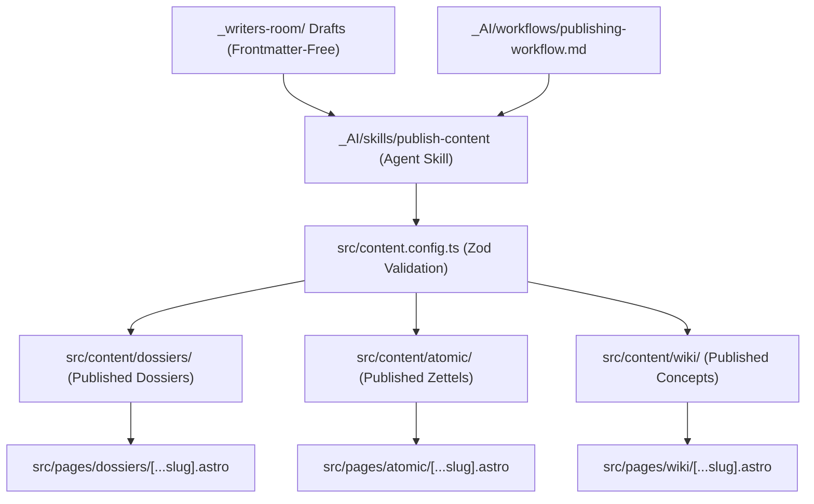

# Astro Content Collections, Dynamic Routes, and Publishing Workflow Integration

This implementation plan details the architectural extensions, frontmatter schemas, route layouts, and agent automation required to transition research drafts from our private collaborative sandbox (`_writers-room/`) to live published collections on the Cybernati website.

---

## User Review Required

Please review the proposed content schemas, URL structures, and workflow boundaries. 

> [!IMPORTANT]
> **Frontmatter & Zod Validation Schemas**
> We have designed custom Zod schemas for the three new content types to enforce data integrity while preserving Obsidian-native usability (e.g. supporting wikilinks, dates, and arrays).
> - **Dossiers**: Tailored for long-form, source-heavy investigative reports (like our chronological UAP management history).
> - **Atomic Notes**: Tailored for Zettelkasten-style card slips—short, interconnected, heavily tagged, and carrying backlink maps.
> - **Wiki Pages**: Conceptual encyclopedic entries representing projects, facilities, people, or groups, sorted by conceptual categories with sidebar links.

> [!TIP]
> **Dynamic Routes vs Catch-all Pages**
> - Dossiers will render under `/dossiers/[id]`
> - Atomic Notes will render under `/atomic/[id]`
> - Wiki Pages will render under `/wiki/[id]`
> - We will create custom layout files (e.g., `DossierLayout.astro`) that inherit from `BaseLayout.astro` but add visual features suited to each type (e.g., timeline container, connection grids, responsive sidebars).

---

## Open Questions

1. **Visual Style for Atomic Notes**: Should Atomic Notes render as high-density grid cards (resembling a visual corkboard) on their index page, or a simple paginated list? We recommend a modern, glassmorphic card-masonry grid that showcases tags and short blurbs.
2. **Dossier Timelines**: For Dossiers that contain visual timelines (like our UAP management draft), would you like the Mermaid diagram to render at full width as a header banner, or remain embedded inside the content block? We recommend embedding it directly above the text chronology to maintain natural reading flow.
3. **Draft-to-Publishing Transition**: Should the `publish-content` skill automatically generate standard metadata (like current dates and default descriptions) if you leave them blank, or prompt you interactively in the chat for every field? We recommend a hybrid approach: auto-fill dates and slug IDs, but prompt for tags or categories if they are missing.

---

## Proposed Changes

We will introduce these changes across the Astro codebase and the Obsidian vault, separating system guidelines from source code.



### 1. Core Codebase (Astro Configurations & Schemas)

#### [MODIFY] [content.config.ts](file:///E:/cyborg-city/cybernati/src/content.config.ts)
* Define and export three new content collections:
  * **`dossiers`**:
    ```typescript
    const dossiersCollection = defineCollection({
      loader: glob({ pattern: '**/*.{md,mdx}', base: './src/content/dossiers' }),
      schema: z.object({
        title: z.string().default('Untitled Dossier'),
        description: z.string().default('Detailed investigative report.'),
        date: z.coerce.date().default(() => new Date()),
        lastModified: z.coerce.date().optional(),
        tags: z.array(z.string()).nullable().optional().default([]),
        sources: z.array(z.string()).nullable().optional().default([]),
        draft: z.boolean().optional().default(false),
        image: z.any().nullable().optional(),
        imageAlt: z.string().nullable().optional(),
        noIndex: z.boolean().optional().default(false),
        featured: z.boolean().optional().default(false),
      }),
    });
    ```
  * **`atomic`**:
    ```typescript
    const atomicCollection = defineCollection({
      loader: glob({ pattern: '**/*.{md,mdx}', base: './src/content/atomic' }),
      schema: z.object({
        title: z.string().default('Untitled Zettel'),
        date: z.coerce.date().default(() => new Date()),
        lastModified: z.coerce.date().optional(),
        tags: z.array(z.string()).nullable().optional().default([]),
        backlinks: z.array(z.string()).nullable().optional().default([]),
        draft: z.boolean().optional().default(false),
        category: z.string().nullable().optional().default('General'),
      }),
    });
    ```
  * **`wiki`**:
    ```typescript
    const wikiCollection = defineCollection({
      loader: glob({ pattern: '**/*.{md,mdx}', base: './src/content/wiki' }),
      schema: z.object({
        title: z.string().default('Untitled Concept'),
        description: z.string().default('Conceptual definition.'),
        date: z.coerce.date().optional(),
        lastModified: z.coerce.date().optional(),
        category: z.string().default('General'),
        tags: z.array(z.string()).nullable().optional().default([]),
        related: z.array(z.string()).nullable().optional().default([]),
        draft: z.boolean().optional().default(false),
      }),
    });
    ```

---

### 2. Astro Pages & Layouts (Routing & Rendering)

#### [NEW] [DossierLayout.astro](file:///E:/cyborg-city/cybernati/src/layouts/DossierLayout.astro)
* Inherits from `BaseLayout.astro`.
* Custom sidebar panel showcasing **Investigative Sources** (clickable external list) and metadata tags.
* Full-width glassmorphic title card with an optional cover image.
* Automatic compilation of dynamic table of contents.

#### [NEW] [AtomicLayout.astro](file:///E:/cyborg-city/cybernati/src/layouts/AtomicLayout.astro)
* Granular card-based layout featuring a dynamic **Backlinks Hub** panel at the bottom (displaying related cards with snippets).
* Heavy visual grouping of tags for fluid conceptual jumping.

#### [NEW] [WikiLayout.astro](file:///E:/cyborg-city/cybernati/src/layouts/WikiLayout.astro)
* Clean, encyclopedic double-column format.
* Left sidebar compiling a **Concept Hierarchy Tree** matching the Wiki category.
* Right-column main body showcasing the content definition, with a footer listing **Related Conceptual Connections**.

#### [NEW] Dynamic detail routes for each collection under `src/pages/`:
* [dossiers/[...slug].astro](file:///E:/cyborg-city/cybernati/src/pages/dossiers/[...slug].astro)
* [atomic/[...slug].astro](file:///E:/cyborg-city/cybernati/src/pages/atomic/[...slug].astro)
* [wiki/[...slug].astro](file:///E:/cyborg-city/cybernati/src/pages/wiki/[...slug].astro)
* Each route dynamically loads Visible entries via `getCollection(key)` and validates visible status using `shouldShowPost`.

#### [NEW] Main index portals for browsing each collection under `src/pages/`:
* [dossiers/index.astro](file:///E:/cyborg-city/cybernati/src/pages/dossiers/index.astro): Card feed of investigations.
* [atomic/index.astro](file:///E:/cyborg-city/cybernati/src/pages/atomic/index.astro): High-density visual masonry grid displaying slips.
* [wiki/index.astro](file:///E:/cyborg-city/cybernati/src/pages/wiki/index.astro): Categorized glossary index matching concepts under alphabetized trees.

---

### 3. Vault & Agent System (Workflow & Automation)

#### [NEW] [publishing-workflow.md](file:///E:/cyborg-city/cybernati/src/content/_AI/workflows/publishing-workflow.md)
* Standard operating procedure (SOP) guiding authors (human or agent) in moving research from sandbox drafts to production:
  1. **Sandbox Phase**: Author drafts in `_writers-room/{project}/draft-{topic}.md` (fully frontmatter-free).
  2. **Review & Type Assignment**: Determine the appropriate target collection (`posts`, `dossiers`, `atomic`, or `wiki`).
  3. **Metadata Ingestion**: Construct frontmatter satisfying the target collection schema defined in `src/content.config.ts`.
  4. **Validation Check**: Run local compilation check.
  5. **Declassification/Publishing Execution**: Safely transfer the file to the target production directory, moving related assets to public locations.

#### [NEW] [publish-content/SKILL.md](file:///E:/cyborg-city/cybernati/src/content/_AI/skills/publish-content/SKILL.md)
* A specialized, rigid agent skill that automates this workflow:
  * **Trigger**: `publish draft path={draft-path} type={collection-type}`
  * **Execution**:
    1. Parse the draft file content.
    2. Prompt the user for missing required metadata (like tags, specific sources, or custom descriptions).
    3. Generate the correct YAML frontmatter block.
    4. Move the draft out of the sandbox and into `src/content/{collection}/{slug}.md`.
    5. Clean up temporary files in `_writers-room/` (archiving clippings, etc.).
    6. Automatically run a dry-run build (`pnpm astro check` & `pnpm build`) to verify zero compile or frontmatter errors.

---

## Verification Plan

### Automated Verification
* Run local typecheck and linting validation:
  ```powershell
  pnpm astro check
  ```
* Run a complete production build to verify Astro parses and outputs static HTML for the three new dynamic routes successfully:
  ```powershell
  pnpm run build
  ```

### Manual Verification
* Boot the local dev server:
  ```powershell
  pnpm run dev
  ```
* Navigate to the index hubs (`/dossiers`, `/atomic`, `/wiki`) to ensure visual layouts and rendering cards look stunning.
* Test responsiveness and interactive timeline features on mobile viewports.
