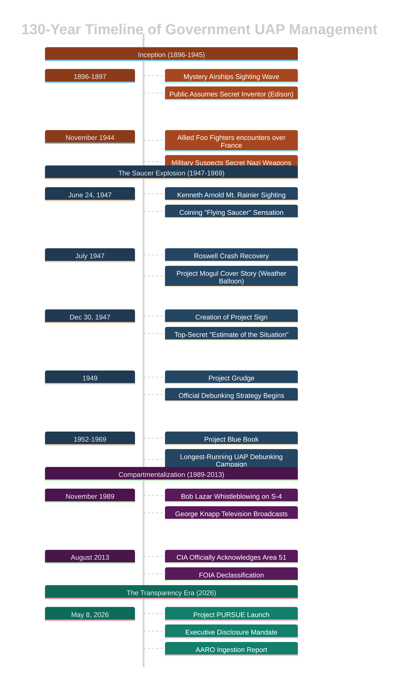

For over a century, the U.S. government has had a complicated relationship with unexplained objects in the sky. The strategies have evolved — denial, debunking, compartmentalization, and now, a carefully managed release of information — but the throughline is consistent: controlling the narrative. Here's how that story unfolded, and why the latest chapter might look less like transparency and more like curation.

## Timeline

---

## Phase 1: The Secret Adversary Trap (1896 – 1945)

Before the acronyms UAP or UFO existed, the default human response to aerial anomalies was immediately shaped by active geopolitical rivalries and industrial secrecy. In this early era, the state and the public reflexively projected their contemporary fears of adversarial warfare onto the skies.

### The 1896 Mystery Airships
Between November 1896 and April 1897, thousands of witnesses across North America observed egg-shaped, mechanical craft carrying powerful electric searchlights. Because the technology seemed years ahead of standard human aviation, the contemporary public assumed a secret, Edison-like inventor was conducting private trials of a revolutionary flying machine. Thomas Edison himself had to issue public denials in the press to quiet the rumors. The state remained largely silent, expecting a private patent to be unveiled at any moment. No inventor ever stepped forward.

### WWII Foo Fighters (1944)
During the height of World War II, Allied pilots of the 415th Night Fighter Squadron flying over northeastern France logged encounters with orange, glowing spheres of "fuzzy plasma light." These objects would track aircraft at high speeds and execute impossible maneuvers before accelerating away. 
* **The Military Reflex**: The Army Air Force took the reports extremely seriously, immediately assuming they were an advanced, secret Nazi German weapon designed to counter Allied air superiority. 
* **The Intelligence Dead-End**: Classified investigations by the Office of Strategic Services (OSS—precursor to the CIA) and British Intelligence failed to locate any evidence of Axis engineering, leaving the "Foo Fighters" completely unexplained.

---
![[Gemini_Generated_Image_sh044bsh044bsh04.png|Depiction of secret Project Blue Book Meeting.]]
## Phase 2: The Security State Debunking Era (1947 – 1969)

Following World War II, the rise of the Cold War and the birth of jet-propulsion aviation permanently shifted UAP history. The government moved away from passive puzzlement toward a systematic campaign to manage public hysteria, while establishing the military as the sole authority on UAP intelligence.

### The Kenneth Arnold Sighting (June 24, 1947)
Private pilot Kenneth Arnold's sighting of nine delta-shaped, tail-less craft traveling at nearly 2,000 km/h near Mount Rainier, Washington, was the modern turning point. His description of them weaving and "skipping like a saucer across water" birthed the term **"flying saucer"** in the media. 
* **The Mechanistic Shift**: Arnold's sighting marked a permanent cultural transition. People stopped viewing anomalous aerial lights as supernatural or divine omens, interpreting them instead as highly advanced, physical, "nuts-and-bolts" foreign or extraterrestrial craft.

### The Rise of Air Force Investigation
In July 1947, the military directed all UAP intelligence to the Air Material Command (AMC) at Wright-Patterson Field in Ohio. Commander Lieutenant General Nathan Twining issued a classified memo declaring that the phenomena were **"real and not visionary or fictitious,"** maneuvered by automatic or manual control. 

This memorandum directly led to a series of Air Force study groups:
1. **Project Sign (December 30, 1947)**: Commissioned to systematically analyze UAP data. Sign's staff privately authored a top-secret *"Estimate of the Situation"* concluding that UAPs were of extraterrestrial origin. This was rejected by Air Force Chief of Staff General Hoyt Vandenberg, who demanded the conclusion be buried.
2. **Project Grudge (1949)**: Established with a strict mandate to downplay and debunk UAP sightings in the public eye to prevent societal panic.
3. **Project Blue Book (1952 – 1970)**: Led by astronomical advisor Dr. J. Allen Hynek, Blue Book spent nearly two decades publicly attributing UAP reports to meteors, mirages, and swamp gas, while privately cataloging thousands of unresolved military encounters.

---

## Phase 3: Tactical Concealment & Compartmentalization (1947 – 2013)

As the Cold War deepened, the government discovered that UAP hype could serve a dual purpose. It wasn't just a problem to manage — it was a convenient cover for highly classified operations. The same secrecy that kept the public in the dark also protected advanced intelligence programs from foreign adversaries.

### The Roswell Incident (July 1947)
When a local rancher discovered metallic debris in a field near Roswell, New Mexico, the Strategic Air Command base initially issued a press release claiming the recovery of a crashed "flying disc." Hours later, they retracted and presented the public with a shredded weather balloon.
* **The Declassified Reality**: Fifty years later, in 1997, the Air Force admitted the wreckage belonged to **Project Mogul** — a highly classified system of high-altitude espionage balloons designed to monitor Soviet nuclear tests. The military actively used the "weather balloon" and "flying saucer" narratives to prevent the Soviet Union from discovering their atomic surveillance technology. The cover story worked so well it defined UFO mythology for generations.

![[Gemini_Generated_Image_sh044bsh044bsh04 (1).png|Depiction of overly compartmentalized government oversight at secret location S-4]]

### Bob Lazar and the S-4 Compartmentalization (1989)
In 1989, physicist Bob Lazar claimed he was hired south of Area 51 at a clandestine, subterranean facility called **S-4 (Site 4)** to reverse-engineer extraterrestrial spacecraft. 
* **The Security Model**: Lazar's claims highlighted the extreme compartmentalization of black-budget projects. As later validated by former Area 51 pilot David Fruehauf, S-4 existed, but its operations were completely isolated from the standard Groom Lake flight-test community.
* **FOIA Validation**: For decades, the CIA and US military denied that Area 51 even existed. In August 2013, a FOIA request finally forced the CIA to officially declassify the base's existence — proving that base-level denials serve as long-term cover stories for secret technology.

---

![[2852d7d4-6fc1-45b2-8d83-9915f2028163.jpg|Image depicting AARO government oversight of UAP files]]

## Phase 4: The Curation Era — Project PURSUE (2026)

And then something changed. Or did it?

On May 8, 2026, under an executive directive from President Donald Trump, **Project PURSUE** (Presidential Unsealing and Reporting System for UAP Encounters) was launched. Overseen by the Department of War with ODNI support, it established a rolling release of declassified UAP records through a public database at [war.gov/UFO](https://web.archive.org/web/20260527160241/https://www.war.gov/UFO/).

What came out was extraordinary by any measure: unredacted Cold War FBI memos, Apollo moon mission transcripts showing astronauts reporting unexplained phenomena from the lunar surface, and full-motion sensor footage of anomalous objects tracked by modern military systems. For the first time, the public could browse the same documents that intelligence analysts were actively reviewing.

![[Gemini_Generated_Image_f0wrg0f0wrg0f0wr.png|A dense, complex investigation corkboard tracking the 130-year history of government UAP narrative control. The board is crowded with pinned historical documents, vintage photographs of mystery airships, typed military memos from Project Blue Book, redacted FOIA requests, and modern 2026 Project PURSUE data sheets. A web of vibrant red yarn crisscrosses the board, physically connecting the documents across four distinct historical phases ranging from "Secret Adversary Trap" to "The Curation Era."]]
### The Ingestion Paradox

But here's where the story gets complicated. Under the All-domain Anomaly Resolution Office (AARO), the government adopted a fascinating new stance — what you might call **transparency without interpretation**. AARO provides high-fidelity declassified telemetry and observation data. They admit that highly credible military pilots and sensors have recorded physics-defying maneuvers. But they maintain that the files contain zero definitive proof of extraterrestrial life, leaving the final synthesis entirely to the public.

It's a brilliant move. After a century of denying, debunking, and compartmentalizing, the government has found a way to control the narrative without saying a word. They open the vault. They let you decide. And if you come to a conclusion they don't like? Well, they never claimed anything.

This isn't a break from the old playbook. It's the natural evolution of it.

---

*For a detailed, living reference on Project PURSUE — including the full list of releases, tranche timelines, and notable document summaries — visit [[dossier/the-project-pursue-reference-dossier/index|The Project PURSUE Reference Dossier]].*
