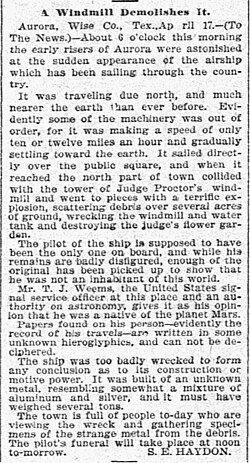
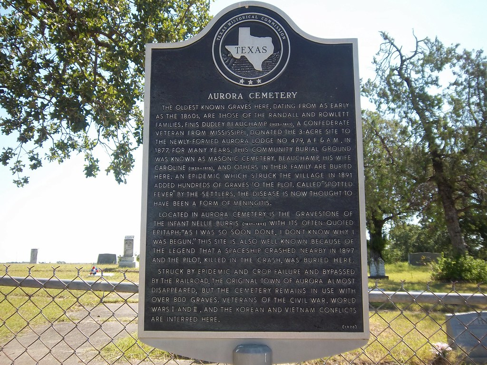

So there I was, digging through old newspaper archives — as you do — and I stumbled across something rather peculiar.

An article from the *Dallas Morning News*, [[vault/the-aurora-texas-incident|April 19, 1897]], reporting that a flying cigar had crashed into a judge's windmill and killed a Martian.

A Martian. In 1897. Six years before the Wright brothers got their contraption off the ground.

You'd think that would have made a bit more of a splash, wouldn't you?

---

## What the Paper Said

The story goes like this. On the morning of April 17, 1897, early risers in Aurora, Texas — a tiny dot on the map about 20 miles northwest of Fort Worth — saw a large silver cigar-shaped object drifting low over their town. It struck a tower on the property of a local judge named J. S. Proctor, exploded with a terrific bang, and scattered junk across several acres.

The pilot was, according to the article, "not an inhabitant of this world." An Army signal officer named T. J. Weems — a keen amateur astronomer, as it happens — gave his opinion that the pilot was a native of Mars. Papers found on his person were written in "some unknown hieroglyphics."

The locals gave the poor soul a Christian burial in the town cemetery, unmarked grave. The wreckage? Tossed down a well.

End of story. Except it wasn't, of course. It never is.

---

## The Well and the Man Who Cleaned It

Fast forward a few decades. A man named Brawley Oates bought the Proctor property somewhere around 1935 and decided to clean out that old well so he could use it for water. He hauled out all the debris — scrap metal, who knows what else — and started using the well.

He then developed one of the most aggressive cases of rheumatoid arthritis anyone had ever seen. His fingers swelled to the size of golf balls. The pain was apparently unimaginable.

Oates became convinced the well water was to blame. Radioactive, he said. Contaminated by whatever crashed there in 1897. He capped the well with a concrete slab and built a shed over it. It's still there.

---

## 1973: The Grave That Had Metal in It

The story might have stayed forgotten if not for two men: Bill Case, an aviation writer for the *Dallas Times Herald*, and Jim Marrs, a reporter for the *Fort Worth Star-Telegram*. In 1973 they decided to have a proper look.

They found the grave. It was small — child-sized — with a crude stone marker etched with what looked like a flying saucer with three portholes. The metal detector screamed: three large pieces of metal, right there under the dirt.

Case and Marrs started asking questions. The cemetery association said they absolutely could not dig. The town was divided — half saying it happened, half saying it was a hoax. Tempers flared.

And then the headstone vanished. When the investigators finally got back to the grave, someone had drilled three small holes straight into it. The metal detector read nothing. The metal was gone. Extracted. Like someone didn't want it found.

---

## What's Actually Left

The well is still there under its concrete cap. Ground-penetrating radar has confirmed there really is a short grave in that cemetery where the marker used to be. The footings of the tower the airship hit were discovered, proving the structure existed despite what the debunkers claimed. And the metal fragments that were found at the crash site? One was 95% pure aluminum with 5% iron — an alloy that shouldn't exist by normal 19th-century metallurgy. Aluminum at the time was more expensive than gold.

Was it a hoax? An elderly resident named Etta Pegues claimed in 1980 that the newspaper reporter made the whole thing up as a joke to put Aurora on the map. The town was dying — the railroad had passed it by, a fire and a spotted fever epidemic had nearly wiped it out. Maybe they needed the attention.

But here's the thing. If it was a hoax, who removed the metal from the grave? Why did the son of the city marshal — the man who guarded that cemetery — tell researchers his father knew who took the headstone but "could do nothing about it"? That doesn't sound like a practical joke that got out of hand. That sounds like someone keeping a secret.

The grave's still there. The well's still there. Nobody's taken a proper look at either one in decades.

Funny that, isn't it.
